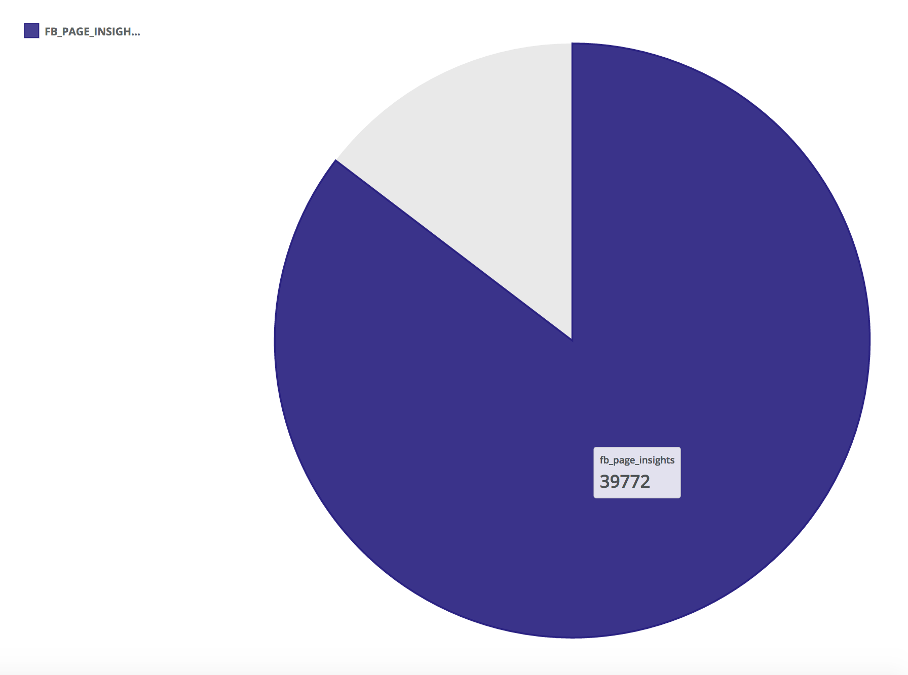
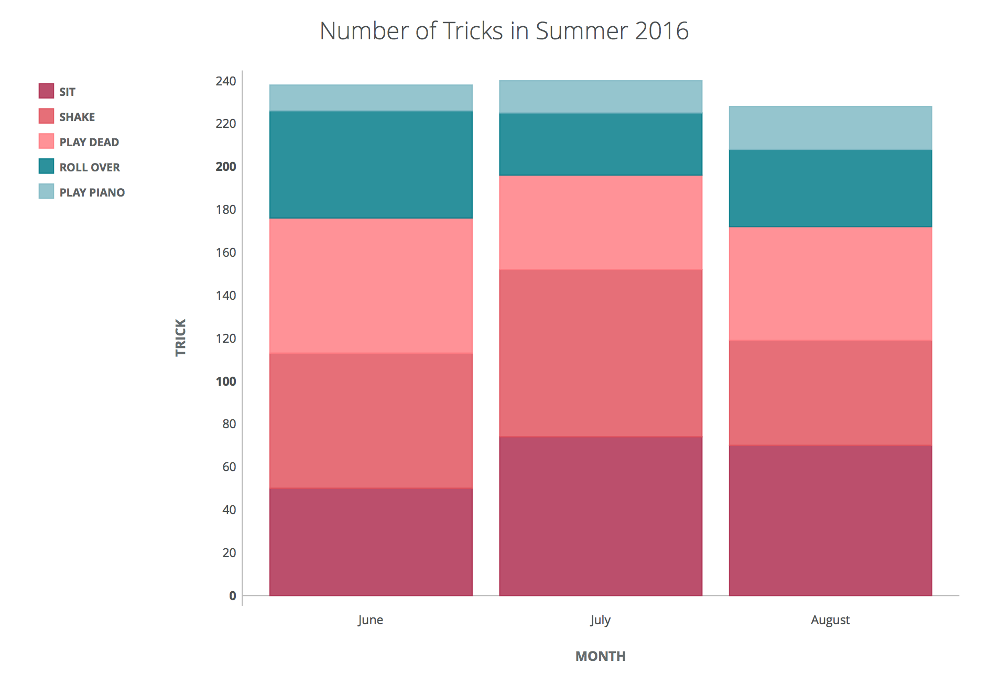

# Overview
Chatlytics is a data query and visualization platform. Part of the platform is a bot called "Fetch". Think of Fetch not just as chatbot, but a analytics assistant too.

Fetch has one key job to perform; help teams use their data to create beautiful visualizations without ever needing to leave Slack (or Hipchat). He takes care of the query, visualization, reports and charting grunt work so your team can focus on more important things. Fetch packages everything in flexible and customizable PNG & interactive SVGs.

- [Prerequisites](#prerequisites)
- [How To Interact With Fetch, Your Analytics Bot](#how-to-interact-with-fetch-your-analytics-bot)
	- [Step 1: Add To Slack](#step-1-add-to-slack)
	- [Step 2: Setup Your Database connection](#step-2-setup-your-database-connection)
	- [Step 3: Ask Fetch To Run Queries For You](#step-3-ask-fetch-to-run-queries-for-you)
- [Teaching Fetch Custom Commands](#teaching-fetch-custom-commands)
	- [Step 1: Defining Custom Commands Via YAML File](#step-1-defining-custom-commands-via-yaml-file)
	- [Step 2: Train Fetch To Understand Your Command](#step-2-train-fetch-to-understand-your-command)
		- [Drag-and-Drop](#drag-and-drop)
		- [Attachments](#attachments)
		- [Remote Import from URL](#remote-import-from-url)
	- [Step 3: Tell Fetch To Run Your New Commands](#step-3-tell-fetch-to-run-your-new-commands)
- [Creating Your Own Themes](#themes)
- [Notes](#notes)
	- [MySQL](#mysql)
- [Issues](#issues)
- [Contributing](#contributing)

## Prerequisites
You will need:
* Database connection parameters. Currently only `PostgreSQL`, `MySQL`, `Amazon Redshift`, `Amazon Aurora (Postgres/MYSQL)` and `AmazON RDS (Postgres/MYSQL)` are supported)
* Slack account for the bot to use. If you do not have one you need to get yourself a Slack account. Go to the Slack webite: https://slack.com/


## How To Interact With Fetch, Your Analytics Bot

### Step 1: Add To Slack

The first step required to set the bot up involves clicking the "Add to Slack" button [here](https://www.chatlytics.co).

Chatlytics is only available for use with Slack at the moment. Other chat clients (Hipchat, Facebook, Skype...) will be added soon!

Once you have connected Chatlytics, you can interact with Fetch by sending commands to the linked Slack account.

You'll find a guide to these commands [here](https://www.chatlytics.co/guide.html). Just select a command in the dropdown to see what fetch will do with it and get additional tips.

### Step 2: Setup Your Database connection
You'll want to start by setting up your database connection. Run the command `!dbconfig` and follow the prompts to get started.

### Step 3: Ask Fetch To Run Queries For You

Fetch has built-in set of commands it understand. To see a list of available commands Fetch can recognize, type `!help`.

The following is a list of available predefined commands:
* `!list_tables`: Returns a list of all tables in the database.
* `!table_count <table_name>`: Returns the number of rows in the table.
  * Example: !table_count MyTable
* `!count_compare <table_name> <date_column> <style>`: Generate gauge chart from comparing record count to the previous day.
  * Example: !count_compare MyTable timestamp blue
		
* `!date_compare <table_name> <date_column> <date1> <date2> <style>`: Generate gauge chart from comparing record count of two different days.
  * Example: !date_compare MyTable timestamp 01/01/16 07/07/16 sunset
* `!chart <table_name> <date_column> <number_of_days> <style>`: Generate a bar chart of record counts from the specified table for the given number of days.
  * Example: !chart MyTable timestamp 10 spring
	  


# Teaching Fetch Custom Commands
In addition to the predefined commands Fetch understands, you can teach it new ones. This is done by feeding Fetch YAML files.  

How do you train Fetch to understand new commands. There are three easy steps:

* Define Your Command In YAML
* Your Train Fetch To Understand The Commands
* You Ask Fetch To Run Your Commands

### Step 1: Defining Custom Commands Via YAML File
To teach Fetch a new command, you need to first create a YAML definition. This is what a sample YAML definition looks like:

```

queries:
    -   name: test_query
        query: select testColumn, count(*) from testTable group by testColumn
        chart_type: bar_chart
        chart_description: test
        style: blue

```

Each element serves a purpose in helping Fetch understand what you want to have happen:

* `name`: The name of the query. This ultimately becomes the command you use to call the query once it's defined.
* `query`: The SQL query to run.
* `chart_type`: The type of chart which you wish to generate. Currently, valid inputs are "bar_chart", "line_chart" and "table".
* `chart_description`: This description will be included when your query is run.
* `style`: the name of the style which you want the output to use

When writing custom queries for `bar_chart` or `line_chart` graph types, it is expected that the first column will be the x-axis and the second will be the y-axis.

### Step 2: Train Fetch To Understand Your Command
With your YAML file completed, it is time to teach Fetch the new command. This will require that you import or "feed" the YAML file to Fetch. There are three methods for feeding Fetch new commands:

* Drag-and-Drop
* Attachments
* Remote Import from URL

#### Drag-and-Drop

The simplest way to import a command is by simply dragging a YAML file to the Slack window and clicking the "Upload" button. The bot will do the rest!

#### Attachments

Alternatively, you can upload a YAML file by clicking the '+' sign at the bottom of the chat window, navigating to the file on your computer and clicking the "Upload" button.

#### Remote Import from URL

To import a remote YAML file from someplace like Github, you must specify a URL to that YAML file in the following format:

`!define <link_to_yaml>`

For example, if the link is from GitHub you'll need to click the **Raw** button at the top of the file and use the resulting URL.

```bash
!define https://raw.githubusercontent.com/dtroberts/TestRepo/master/ymls/multidef.yml
```


### Step 3: Tell Fetch To Run Your New Commands

Once the query is defined and imported, it will be accessible via `!name`, where name is the value of the `name` field in the YAML file.

### Examples
Here is an example of a YAML file which would create a command `!my_first_command`:
```
queries:
    -   name: my_first_command
        query: select timestamp::date, sum(subscribers) from MyTable where datediff(day, end_time::date, getdate()::date) < 30 group by timestamp::date
        chart_type: bar_chart
        chart_description: My first query definition
        style: blue
```
This would output a chart with the daily number of subscribers over the last 30 days.

It is also possible to define multiple commands in the same file. This YAML file would define the commands `!MainTableQuery` and `!OtherTableQuery`:
```
queries:
    -   name: MainTableQuery
        query: select testColumn, count(*) from MainTable group by date
        chart_type: bar_chart
        chart_description: My first query definition
        style: sunset

    -   name: OtherTableQuery
        query: select testColumn, count(*) from OtherTable group by timestamp
        chart_type: line_chart
        chart_description: Line chart for OtherTable record counts
        style: spring
```

**IMPORTANT**: Custom commands are removed upon shutting down or restarting servers. In a future release we will add persistence capabilities when training Fetch.

# Creating Your Own Themes

Did you know you Fetch allows you to customize the look and feel of your visualizations?  You can fully customize the colors and typography to fit your own preferences.  Themes define the style of the visualizations Fetch delivers to your team. Each Theme may be different, offering many choices to easily change the look and feel. Themes also separate the presentation styles from the underlying data. Using Themes allows you to quickly change the visual style and layout of a visualization with simple CSS edits.

You may wish to Themes for your own use, for a client project or to be shared with the Chatlytics community!

Themes are simple to create and use. All you need is clean, valid CSS. Take a look at the theme
[how-to](/THEMES.md) guide and templates.

# Notes

### MySQL
MySQL connections cannot be opened in read-only mode. As such, any query defined here can be run on the database. The best solution to ensure the security and integrity of your database is to create a new user for use with Chatlytics with read-only permissions and specify those credentials in `!dbconfig`.

For instructions on how to set up a read-only user, see the [guide](http://www.alphadevx.com/a/388-Adding-a-read-only-MySQL-user).

# Issues

If you have any problems with or questions about this image, please contact us through a GitHub issue.

# Contributing

You are invited to contribute new features, fixes, or updates, large or small; we are always thrilled to receive pull requests, and do our best to process them as fast as we can.

Before you start to code, we recommend discussing your plans through a GitHub issue, especially for more ambitious contributions. This gives other contributors a chance to point you in the right direction, give you feedback on your design, and help you find out if someone else is working on the same thing.
